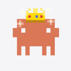
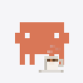
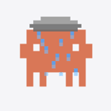
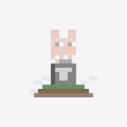

# telinha

Cliente, daemon e pipeline de build para a **Minitela** do notebook
**Positivo Vision R15M** — um display IPS de 1,54", 240×240, embutido no chassi.

De fábrica ela só mostra notificações do WhatsApp, clima e fotos, via um app
fechado da Positivo que não roda no Fedora. Este projeto fala com ela
diretamente e exibe o que a gente quiser: hoje, o mascote **Clawd** do
[claude-usage-widget](https://github.com/MrSchrodingers/claude-usage-widget),
que muda conforme o modelo Claude em uso e avisa quando o consumo de tokens
aperta.

## Os bichinhos

Conforme o modelo em uso — troca instantânea, só um registrador serial:

|  |  |  |
|:---:|:---:|:---:|
| **opus** — gênio | **sonnet** — esperto | **fable** — no fogo |
| página 6 | página 7 | página 5 |

Conforme o consumo de tokens — o conjunto inteiro troca (re-upload, ~15s):

|  |  |
|:---:|:---:|
| **70–90%** — chuva | **≥ 90%** — fantasminha |

A tecla física "Minitela" cicla os três bichinhos do conjunto ativo. Prioridade:
tecla (override de 20s) > alerta > modelo.

> Os GIFs acima são o render de verdade — a mesma função que gera o que vai para
> o display. Reproduza com `minitela build normal -o clawd.acf`.

## Como funciona

O display roda um firmware **AHMI** com páginas fixas, compiladas. Não dá para
"desenhar na tela": o que se faz é **recompilar o projeto de fábrica** trocando
os recursos, subir o `.acf` resultante e trocar a página ativa por um registrador
serial.

A descoberta que destrava tudo: **a definição da animação (número de frames,
delays) vive no firmware**, ligada a cada página de gif. O `.acf` só entrega os
pixels. Basta trocar o gif de origem por um com o mesmo número de frames.

```
sprites  ->  gif (paleta global)  ->  file.zip  ->  AHMISimGenDemo (Wine)  ->  .acf
                                                                                |
                                              /dev/ttyACM0  <-  upload (SideCar)
                                                    |
                                          show-page 5|6|7  (registrador 2)
```

**Limite do hardware:** só existem **3 páginas com animação** (5, 6 e 7). Ter 5
bichinhos animados com troca instantânea é impossível sem re-flash do firmware —
está provado, não reabra. Ver `docs/`.

## Instalação

```bash
git clone <este-repo> telinha && cd telinha
python3 -m venv .venv
.venv/bin/pip install -e ".[dev]"
```

Dependências de sistema e o material de terceiros (o app da Positivo, o
compilador AHMI, o SideCar) **não são redistribuídos aqui** — veja
[`scripts/bootstrap-vendor.md`](scripts/bootstrap-vendor.md) para obtê-los.

Sem esse material você ainda usa o daemon, troca de página e sobe um `.acf`
pronto. O que exige o material é **gerar um `.acf` novo**.

## Uso

```bash
minitela handshake                      # o dispositivo responde?
minitela show-page 6                    # troca a página ativa
minitela detect-tecla                   # mostra o keycode de cada tecla (root)
minitela build normal -o clawd-anim.acf # gera o .acf de um conjunto
```

Subir o `.acf` no display (o upload ainda usa o SideCar):

```bash
sudo systemctl stop minitela-daemon.service   # evita disputa pelo serial
./sidecar/SideCar-fixed -mode cli -cmd upload -file clawd-anim.acf \
    -type texture -device /dev/ttyACM0
sleep 6                                       # o upload ocupa o serial ~6s
minitela show-page 5
```

O daemon (`minitela_clawd.py`) segue o modelo em uso, o alerta de tokens e a
tecla física. Precisa de root para ler `/dev/input/event*`:

```bash
sudo .venv/bin/python minitela_clawd.py
```

## Testes

```bash
pytest              # 192 testes, sem hardware, em qualquer máquina
pytest -m hardware  # exige a Minitela conectada
```

A suite padrão não abre `/dev/ttyACM0` nem `/dev/input/*`: o serial é um
`socketpair` e a tecla é um `BytesIO` com bytes de `input_event`.

## Estrutura

```
src/minitela/
├── core/       protocolo (puro), transporte (I/O), dispositivo, páginas
├── dados/      modelo em uso e consumo de tokens
├── daemon/     decisão pura: modelo + alerta + tecla -> o que mostrar
├── entrada/    a tecla física, direto do /dev/input
├── render/     composição do Clawd (Pillow puro) + sprites vendorizados
├── build/      gif -> projeto AHMI -> compilador -> .acf
└── cli.py

patches/sidecar/  nossas correções ao SideCar (3 bugs), sobre o upstream d356c2b
docs/historico/   as investigações, incluindo as rotas refutadas
```

Na raiz ainda estão `minitela_clawd.py`, `minitela_daemon.py`, `minitela.py` e
`minitela_modelo.py` — o daemon legado, que segue no ar. A migração para o pacote
está planejada e não foi executada; ver "Estado" abaixo.

## Estado

Funciona no hardware real: bichinho animado, troca por modelo, alerta de tokens
e tecla física — tudo confirmado no dispositivo.

A reorganização em pacote está **parcial**. O que está pronto: núcleo serial,
decisão de estado, tecla, render e build, todos com testes. O que falta: migrar
o daemon e o serviço systemd para o pacote (o legado da raiz ainda é quem roda),
e reescrever a documentação — o `CLAUDE.md` atual tem contradições conhecidas.

## Licença

MIT para o código deste repositório. **Não se estende** ao material da
Positivo/Sigma nem ao SideCar; os sprites do Clawd são MIT do
claude-usage-widget, redistribuídos com atribuição em
`src/minitela/render/sprites/LICENSE`. Ver [LICENSE](LICENSE).

O trabalho de engenharia reversa aqui descreve comportamento observado para
interoperabilidade; não contém nem redistribui código proprietário.
